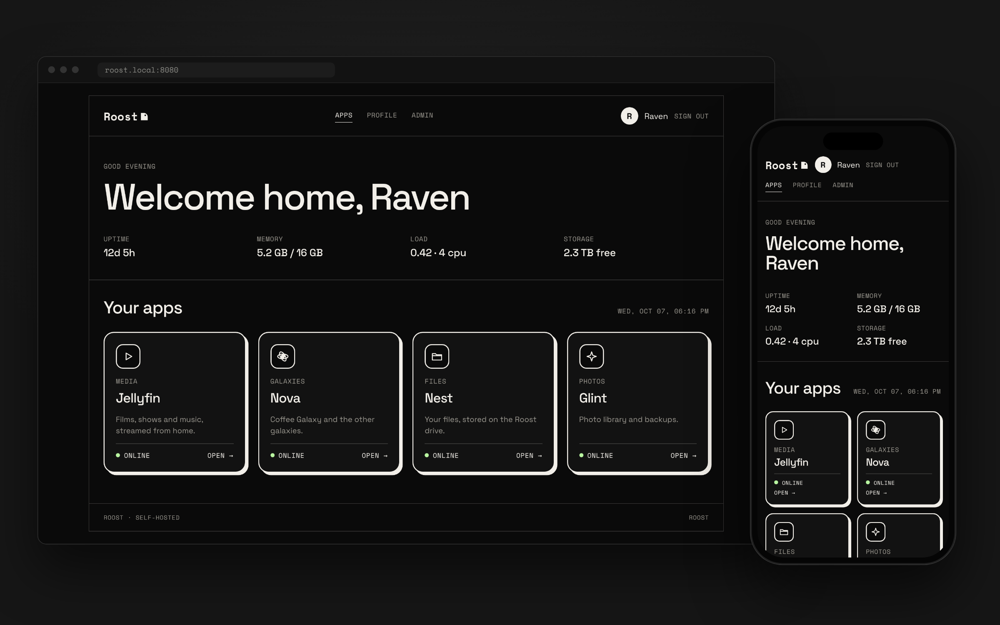
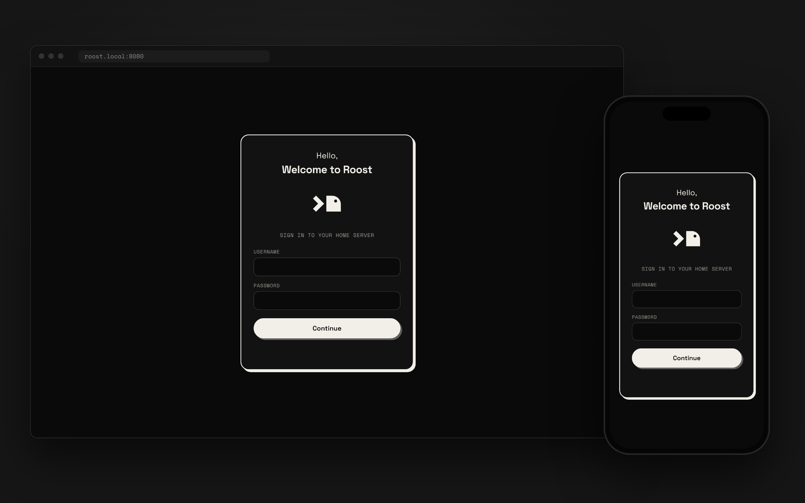
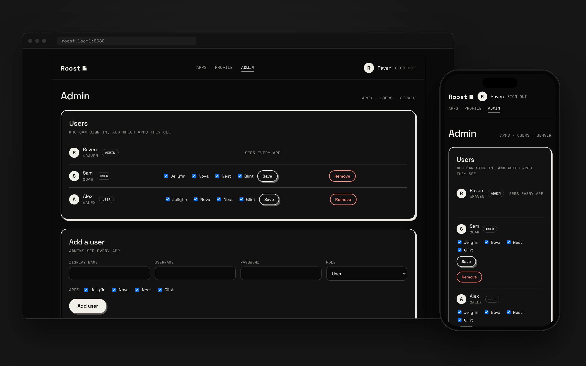

# Roost

Roost is the home-server suite: one homepage that signs you in and shows the apps you can use.



| App | What it is |
| --- | --- |
| Jellyfin | Media (films, shows, music) |
| Nova | The galaxies, starting with Coffee Galaxy (own repo for now, merging in later) |
| Nest | File storage, built into Roost (the Files page) |
| Glint | Photos and videos, built into Roost (the Photos page) |

## Setup checklist

**Admin → Setup** walks through everything Roost needs, one step at a time. Each step covers the data drive, the domain, the email relay, two-step sign-in and so on, and gives the exact steps, including the ones outside Roost. Roost checks most steps itself and ticks them off as you go. Until every step is done, admins see a "Setup · 3 of 9 done" link on the dashboard.

The steps live in `src/setup.js`, which is the single tally of what setting up Roost involves. **When a change needs something set up (a setting, an environment variable, a DNS record, a drive), add a step there in the same change**, with a check if Roost can see it. `npm test` fails if an environment variable or saved setting in `src/` has no step (or a reason under `NO_STEP` for not needing one).

## The homepage

- **First run** creates the admin account.
- **Dashboard**: greeting, live server stats (uptime, memory, load, free space on the data drive) and a card for every app you have access to, each showing whether the app is reachable.
- **Status**: refreshes every 5 seconds. First, each app (and Roost itself) with its container state from Docker: running, stopped, restarting, unhealthy, how long it has been up and how often it restarted, plus whether it answers on its link. Admins also see every other container, and a **Restart** button on apps they're allowed to restart (it asks first, then waits until the app is back up). Below that, server health: uptime, CPU, memory and free space on each drive. Each app also shows a 30-day uptime strip, one bar per day (tap a day to see when it was down). Roost keeps this itself in `uptime.json` next to its data, starting from the day it is installed; days Roost was off show as no data. Problems are listed at the top.
- **Profile**: change your display name and password, turn two-step sign-in on or off, see where you're signed in and sign other devices out, see your storage use and limit, and ask an admin for more space.
- **Admin**: edit the app list and links, invite or remove users, make password reset links, choose which apps each user sees and how much storage they get, approve or decline storage requests, connect Jellyfin sign-in, rename the server, and set up HTTPS.





**Admin → Apps → + Add app** lists the apps Docker is running that have no card yet, with the port each is really published on, then a few templates (Roost's own apps, Home Assistant, Navidrome, Audiobookshelf, Portainer). Tap one and a filled-in card appears; check it and press **Save apps**. **Blank card** is still there for anything else. Roost only asks Docker when the list opens.

App links can use `{host}`, which becomes whatever address you opened Roost on. `http://{host}:8096` works from the LAN IP, the hostname or a Tailscale name without editing anything.

## Search

The box at the top of the dashboard searches every app you can open at once and groups the results by app. Today it searches Nest file and folder names (every word typed has to match; press `/` to jump to the box). Nothing is copied into a separate index, so results are always current and nothing runs when nobody is searching. An app that is slow is cut off after 1.5 seconds so it can't hold up the rest.

New apps plug in as a source in `src/search.js`: `{ app, search(user, q, limit) }` returning `{ items: [{ id, name, kind, mime, detail, href }], more }`. Glint will add one when it exists. Jellyfin has its own accounts, so searching it needs each Roost user linked to their Jellyfin user first, and is left for later.

## Nest (Files)

Nest is Roost's own file storage, built to work like Google Drive. Open it from **Files** in the menu or the Nest card.

- **My Drive**: make folders, upload files or whole folders (button or drag and drop), download (folders and several items come as one zip), rename, move, make copies. List or grid view, sorted by name, date or size.
- **Trash**: deleted items wait 30 days, then go for good. Restore puts them back where they were. Everything in the trash still counts toward your storage.
- **Undo** follows every move, rename and delete.
- **On a computer**: click selects (Ctrl/Cmd to add, Shift for a range), double-click opens, right-click for actions, drag onto a folder to move. Delete, F2 (rename), Ctrl/Cmd+A and Esc work as expected.
- **On a phone**: tap opens, long-press starts selecting, ⋯ or a tap on a file shows its actions, and the round + button uploads or makes a folder.
- **Big uploads** go in 16 MB pieces, three files at a time. A dropped connection picks up where it stopped, and the upload panel keeps going while you browse.

Files are stored as ordinary files and folders, laid out the way you see them, so they stay readable even without Roost: `NEST_DIR/<username>_<id>/files/...` (the trash is next to it in `trash/`). Folder details (ids, trash dates) are kept in `/data/nest.db` (SQLite, built into Node). Uploads are refused when they would go over your storage limit or leave less than 1 GB free on the drive. Removing a user leaves their Nest folder on the drive.

## Glint (Photos)

Glint is Roost's own photo library, built on Nest's storage. Open it from **Photos** in the menu or the Glint card.

- **Photos**: everything newest first, with a heading per month. Tap a photo to open it full screen (arrow keys, or swipe sideways; swipe down to close), with favourite, add to album, download and delete right there. Videos play in place.
- **Favourites**, **Albums** (make them from a selection; deleting an album keeps its photos) and **Trash** (30 days, same as Nest, and it only ever shows photos and videos).
- **Upload** with the + button or by dropping files. On a phone the + opens the photo picker. Photos already in Glint (same name and size) are skipped, and the dates in the photo (the camera's date, not the upload day) decide where it sits in the timeline.
- **No double work**: Glint uploads go into `Photos/<year>` in Nest, so they share the storage limit (with the same **Ask for more** link when it is full), the trash and zip downloads. Photos and videos you put in Nest yourself show up in Glint too.
- **Light on the server**: Glint does no image processing. The browser that uploads a photo reads its date and draws the small preview (about 30 KB, kept in `.glint/` next to the user's files); older photos get theirs the first time they scroll into view. A format the browser can't draw, such as HEIC on Windows, shows a placeholder and offers a download instead.
- **Not included**: automatic background backup (that needs a phone app, so for now it is a tap on Upload), and face or object recognition.

Files can only be served as a photo or video type a browser can show, with scripts switched off, so an uploaded web page can't run inside Roost.

## Invites and password resets

Nobody needs to be in the room to get an account. Under **Admin → Invite someone**, pick their role, apps and storage limit and press **Create invite link**. Copy the link (or use **Share** on a phone) and send it any way you like. It looks like `https://roostos.network/j/K7PX-2QM9`. They open it, choose their own username and password, and are signed straight in.

- An invite works once and stops working after 7 days. Pending invites are listed under the form, where you can cancel one.
- The link is only shown when you make it. Lost it? Cancel it and make a new one.
- If someone forgets their password, press **Password reset link** next to their name under **Admin → Users** and send them that (`/r/…`). It works once for 24 hours, and saving the new password signs them out everywhere else.
- Codes are 8 characters with no look-alikes (no 0/O or 1/I/L), so they can be read out and typed in any case, with or without the dash. Wrong guesses are rate limited per address and codes are stored hashed.
- Set **Admin → Server → Public address** (for example `https://roostos.network`) so links use it even when you make them at home. Left blank, links use whatever address you opened Roost on, so one made on `http://192.168.1.20:8080` only opens at home.

## Email (Forgot password and emailed invites)

Optional. With email set up, the sign-in page gets **Forgot password?**, which emails a reset link that works once for 1 hour. Invites and reset links can also be emailed straight from Admin. Users add their email address on **Profile**, or when they join from an invite.

A home connection can't deliver email reliably: most providers block outgoing mail, and home addresses are on spam blocklists. So Roost hands each email to a relay over SMTP, using its own built-in sender (no packages). Any SMTP relay works. Two with free plans that let you send as your own domain:

- **Resend**: 3,000 emails a month, 100 a day. SMTP host `smtp.resend.com`, port 587 (STARTTLS), username `resend`, password = an API key.
- **Brevo**: 300 emails a day. SMTP host `smtp-relay.brevo.com`, port 587, with the login and SMTP key from its SMTP settings.

To send as `server@roostos.network`:

1. Sign up with the relay and add `roostos.network` as a sending domain. It gives you a few DNS records (SPF and DKIM). Add them in Cloudflare → DNS. Without them, mail lands in spam.
2. In Roost, open **Admin → Server**, set **Public address** to `https://roostos.network`, and save. Email links always use this address.
3. Fill in **Admin → Email** with the relay's details and **Send from** `server@roostos.network`, then press **Send me a test email**. It goes to the email on your Profile.
4. Optional: so replies to `server@` reach you, turn on Cloudflare **Email Routing** and forward that address to your own inbox.

The relay password is kept in `roost.json` and is never sent back to the browser. Leave **Mail server** blank to turn email off.

## Storage limits

Every user has a storage limit in GB, picked with a slider that runs up to the size of the data drive (or typed exactly; admins can also tick "No limit"). New users start with the default set under **Admin → Server** (50 GB unless changed); only admins can change a limit. Other users can ask for more from their Profile, and the request waits under **Admin → Storage requests** until an admin approves it (optionally with a different amount) or declines it.

Nest is part of Roost, so it enforces the limit itself and its usage shows up on the Profile straight away. From 90% full, Nest shows an **Ask for more** link under its storage bar (admins get **Raise limit**), and an upload that would go over stops with the same link instead of a retry. Glint stores its photos in Nest, so the same limit and the same link apply. The app API below is for any other storage app and uses the token in `ROOST_APP_TOKEN` (it is off when unset):

```
GET /api/storage/users/<username>          → { storage: { limitBytes, usedBytes, remainingBytes, ... } }
PUT /api/storage/users/<username>/usage    { "app": "nest" | "glint", "bytes": 123 }
Authorization: Bearer <ROOST_APP_TOKEN>
```

## HTTPS

Roost gets and renews its own certificate from Let's Encrypt, with no extra containers or packages. It covers your domain and every name under it (`roostos.network` and `*.roostos.network`), so Jellyfin, Nest and Glint can share it later.

1. Put the domain's DNS on Cloudflare (the free plan is enough).
2. In Cloudflare, go to **My Profile → API Tokens → Create Token** and use the **Edit zone DNS** template, limited to that one domain.
3. In Roost, open **Admin → Secure connection**, enter the domain and paste the token. Roost proves it owns the domain by adding a temporary DNS record, so no router ports need opening for this.
4. Point a name such as `roost.roostos.network` at the server. At home, add it to your router's local DNS (pointing at the server's LAN IP) so traffic stays on your network; from outside, use Cloudflare.

Roost checks the certificate twice a day and renews it 30 days before it runs out. If renewal keeps failing, the status page warns admins two weeks before expiry. HTTPS listens on container port 8443, published as 443 in `docker-compose.yml`; if ZimaOS already uses 443, publish a different port. Set `ROOST_ACME_STAGING=true` to try the setup with Let's Encrypt's test certificates first (browsers won't trust those). The certificate and keys are kept in `/data/tls`.

Sign-in cookies are marked Secure whenever Roost is opened over HTTPS, directly or through Cloudflare.

## Reach it from outside

With HTTPS set up, **Admin → Remote access** gets Roost reachable away from home, behind Cloudflare, with no extra software:

1. Tick **Keep the domain pointed at this connection**. Roost keeps the domain's DNS record (orange cloud on, so your home address stays hidden) on your current home address, using the same Cloudflare token.
2. In your router, forward external port 443 (TCP) to this server's port 443. In Cloudflare → SSL/TLS, choose **Full (strict)**.
3. Press **Check now**. Roost asks for its own address from outside and says what it found. If your internet provider shares one address between homes (CGNAT), Roost says so; ask them for a public address.
4. Optional: tick **Only accept outside traffic that comes through Cloudflare**, so anyone who finds your home address can't skip Cloudflare. Your home network still gets in directly.

Cloudflare's free plan limits one request to 100 MB, which Nest respects by uploading in 16 MB pieces. It doesn't allow streaming video through it, so Jellyfin from outside the house needs a different route (planned).

## Coffee Galaxy through Roost

Coffee Galaxy can stay on its own server and still be opened at `nova.<your domain>/coffee`, with Roost as the only sign-in. Roost and that server talk over a private WireGuard link, so the server needs no open door except one UDP port, and your router needs nothing new.

1. On the Coffee Galaxy server, run its `deploy/wireguard-oracle.sh`; it prints the server's public key. Allow UDP 51820 in the server's cloud console.
2. In **Admin → Coffee Galaxy**, paste that key and the server's address, press **Save**, then give Roost's public key (shown on the card, with a Copy button) to the server's script.
3. Press **Make a secret**, copy it into Coffee Galaxy's `config.json` as `roost_sso_secret` (and set `roost_gateway_ip` to `10.77.0.1`). Keep it out of chat and git.
4. Tick **Open Coffee Galaxy through Roost** and Save. With **Remote access → Keep the domain pointed** on, Roost also points `nova.<your domain>` at home.
5. Tick Coffee Galaxy for the people who should have it (Admin → People). Guests get it too, until their pass ends.

On every request Roost checks the sign-in, the app, and the guest pass, then adds `X-Roost-User`, `X-Roost-Admin`, `X-Roost-Ts` and `X-Roost-Sig` (HMAC-SHA256 of `ts\nuser\nadmin`, keyed with the secret text) and removes any such headers the browser sent. The Van Reader phone app's address (`/__vanstock/helper`, limited to 60 a minute per address), `/__health`, the manifest and the two icons need no Roost sign-in. The WireGuard link is made inside the Roost container, so the compose file gives it `NET_ADMIN`; remove that line if you don't use this.

## Two-step sign-in

After the password, Roost asks for a 6-digit code from an authenticator app (Google or Microsoft Authenticator, 1Password, Bitwarden, or the phone's own passwords app). It's built into Roost with no outside service, using the standard TOTP codes (RFC 6238); Roost draws the setup QR code itself.

- **Admins must use it** (turn this off under **Admin → Server**). Right after signing in, an admin without it is taken to the setup screen and can't open Admin until it's done. Everyone else is offered it once after signing in and can turn it on later from **Profile**.
- **Setup**: scan the QR code (on a phone, tap **Open in authenticator app**; or type the key), enter one code, then save the 10 recovery codes.
- **Signing in**: the code box opens the number keypad, phones can fill the code in, and it signs in as soon as 6 digits are in. **Trust this device for 30 days** skips the code on that device. Each code works once, and codes from a phone clock up to 30 seconds off are accepted.
- **Lost phone**: sign in with a recovery code (each works once), or an admin presses **Reset two-step** on that user under **Admin → Users**, and they set it up again. If the only admin is locked out, run this on the server:

```sh
docker exec roost node src/cli.js reset-two-step <username>
docker restart roost
```

Recovery codes and trusted devices are stored only as hashes. The authenticator secret has to be stored as-is in `roost.json`, so keep that file as private as the server itself.

## Backups

Every night (at 3:00 unless you change it), a second container (`roost-backup`, built from the same image) backs up Nest, every app's settings and Roost's own data to a USB SSD plugged into the server. Films and shows aren't backed up. The setup checklist walks through plugging the drive in.

- Each night is a dated folder on the drive (`Roost Backups/2026-10-08 0300/`) that looks like a full copy. Unchanged files are hard links to the night before, so they take no space and no time; identical files are stored once; documents, settings and databases are stored gzipped (`.gz` added to the name).
- By default it keeps the newest backup of each of the last 7 days and of each of the last 4 weeks.
- **Admin → Backups** sets the time of day, how many nightly and weekly backups to keep and an optional drive size limit (the oldest backups go first). It also shows the drive's space, the last 14 runs, and has **Back up now** and **Cancel**. Roost passes these to the backup container through a small request file in its data folder.
- Nest's database is copied with SQLite's `VACUUM INTO`, so the copy is consistent while Nest is running. Other files that change mid-copy are read again.
- Roost never backs up onto the drive the data is on: if the SSD is unplugged, backups wait and the dashboard says "Backup drive not found".
- The drive must be a Linux format (ext4) for hard links. ZimaOS Storage can format it.
- The dashboard shows when the last backup finished, and turns amber after two missed nights and red when a backup failed or the drive is missing.

### Getting files back

**Admin → Backups → Get files back** browses any backup like a folder. For a file or folder you can **Download** it (folders come as a .zip) or **Restore to Nest** (inside Nest folders only). A restore never overwrites: it makes a new folder called "Restored from backup 2026-10-08 0300" in that person's Nest and puts the files there, with their original dates. It checks the person's storage limit first and refuses before anything is made if it won't fit. Nothing already in Nest is changed. To put a Nest file back where it was, move it out of that folder yourself.

### If the server itself is gone

Reinstall Roost, plug the backup drive in, and add a folder to the `roost-backup` service in `docker-compose.yml` to receive the files (the `/DATA/restored:/restore` line is there, commented out). Then:

```sh
docker exec -it roost-backup node src/restore-cli.js list
docker exec -it roost-backup node src/restore-cli.js restore "2026-10-08 0300" /restore
```

You can pass a path inside the backup after the output folder (for example `Nest`) to get back only that part. The files land in `/DATA/restored` as `Nest/`, `Roost/` and `App settings/`; stop Roost, move each folder to where it came from (Nest to `/DATA/roost-nest`, Roost to `/DATA/AppData/roost`, App settings to `/DATA/AppData`), and start it again. The command refuses a folder that already has files in it. With `--replace` it moves the existing folder aside (to `<folder>.before-restore-<time>`, never deleted) after you type `restore` to confirm.

## Saving home upload

Home upload is slow (about 18 Mb/s), so Roost sends as little as it can to people away from home, with nothing outside to set up:

- Roost's own pages and scripts are cached by the browser for a year (the page links each file with a version, so updates still arrive at once), and text is compressed.
- Nest downloads carry a version tag; a device that already has the file gets a tiny "not changed" reply instead of the file, and a resumed download of a changed file starts over.
- Bigger answers (folder lists, status) are compressed.
- Status → *Sent away from home* shows, for admins, how much Roost, Nest and Jellyfin (watched through Roost) sent outside the house today and this week (counted per day, kept for 31 days). Home addresses (192.168.x.x, 10.x.x.x and so on) are not counted; Tailscale addresses are, since they still use the upload.

Behind a tunnel or proxy, set `BEHIND_PROXY` to `true` so away visitors are told apart from home ones.

## One sign-in

Roost is the only account system: one username and password (plus two-step sign-in) for Roost and the apps it serves.

- **Staying signed in**: sign-ins are saved to `sessions.json` next to `roost.json`, so restarting or updating Roost doesn't sign anyone out. Only hashes of the sign-in tokens are written. A browser stays signed in for 30 days.
- **Signed-in devices**: Profile lists every browser and app signed in to your account (for example "Safari on iPhone"), with when each was last active. Sign out any one of them, or all except the one you're on. Changing your password signs out every other device.
- **Device keys for phone apps**: an app signs in with `POST /api/login` and `{ "username", "password", "device": "Raven's iPhone" }` (then `/api/login/code` if two-step is on), and gets a `key` back instead of a cookie. It sends `Authorization: Bearer <key>` on every request. Keys last a year and show up under signed-in devices.
- **For apps Roost serves** (Nest and Glint, or anything behind a proxy): `GET /api/auth/check?app=<app id>` answers 200 with `{ user: { id, username, displayName, role } }` when the browser or key is signed in and allowed that app, 401 when nobody is signed in, and 403 when they don't have access.

### Jellyfin

Connect Jellyfin under **Admin → Jellyfin sign-in**: its address as Roost reaches it (on ZimaOS, the server's LAN address and port, e.g. `http://192.168.1.20:8096`) and an API key made in Jellyfin under **Dashboard → API Keys**. Then:

- **Same account everywhere**: everyone with Jellyfin access gets a Jellyfin account with their Roost username and password. Roost only knows a password when it's typed, so the account is made or updated when the user is added, signs in, or changes their password. An existing Jellyfin account with the same name is taken over at the person's next Roost sign-in. Jellyfin admin accounts are never changed.
- **Opens signed in**: the Jellyfin card opens Jellyfin through Roost at `/jellyfin/`, already signed in as that person, in any browser on any device. Each Roost sign-in is its own Jellyfin device, and signing out of Roost signs that browser out of Jellyfin too.
- **Access follows Roost**: taking Jellyfin away from someone, or deleting them, switches their Jellyfin account off and ends their Jellyfin sign-ins. Giving it back switches it on again.
- **Only for people Roost lets in**: `/jellyfin/` needs a Roost sign-in with Jellyfin access, so Jellyfin isn't reachable through Roost by anyone else.
- **Jellyfin's own apps** (TV, phone) sign in with the same username and password once per device.
- If Jellyfin is down or the link is off, Roost works as before and the card opens Jellyfin's own address.

## Updating Roost

**Admin → Updates** shows what's new on GitHub and updates Roost with one button. Nothing updates by itself: Roost looks at GitHub when the updater starts and every 12 hours (one small `git fetch`), or when you press **Check now**, and lists the changes waiting. **Update Roost** asks first, then:

1. brings in the new code (a fast-forward only, so it never overwrites anything),
2. builds the new version while the old one keeps running (a version that won't build changes nothing),
3. restarts Roost and its backup service, and waits for Roost to report healthy.

If the new version doesn't start, the previous image and code are put back and the card says why (with the last lines of Roost's log under "Technical details"). Updates are written to Admin → Activity. An update is refused while a backup is running, and when the server's copy of the code has changes of its own that the update also changes: keep your own compose edits (drive folders, time zone) in `docker-compose.override.yml` next to `docker-compose.yml`, which Docker merges in and git never touches.

**From SSH** (the first time, or whenever Roost itself is down), `scripts/update-roost.sh` does the same job by hand:

```
curl -fsSL https://raw.githubusercontent.com/Winter2552/RoostOS/main/scripts/update-roost.sh -o update-roost.sh
bash update-roost.sh              # lists what's new, asks, then updates (-y skips the question, --check only looks)
```

It finds Docker and Roost's folder (cloning it first if it isn't there), fast-forwards the code while keeping any edits you made by hand (a copy is saved next to the folder), rebuilds and restarts with `docker compose`, waits for Roost to report healthy, and puts the old version back if it doesn't. It also starts the `roost-updater` service the first time, so Admin → Updates works afterwards. Your accounts and files live outside the folder and aren't touched.

It's done by the `roost-updater` service (`updater/`, built from this repo, no outside image apart from Node and Alpine's `git` and `docker` packages). It has no web port: the Roost web app leaves a small request file in the data folder and reads the updater's report from another, so Roost itself never touches Docker or git. The updater does hold the Docker socket, so it only runs the fixed steps in `updater/update-service.js`, and only fetches this project's own repository. Point its `/src` line at the folder holding Roost's files; that folder must be a git copy (`git clone https://github.com/Winter2552/RoostOS`), and Roost must have been started from it with `docker compose up -d --build`, not imported by ZimaOS under another name (the updater says so if it was). When an update changes the compose file or the updater itself, the card says so: Roost and its backups are updated, and the rest needs one `docker compose up -d --build` in that folder.

## Stack

Plain Node.js (22.13+) with no npm dependencies, and a vanilla HTML/CSS/JS front end with no build step. Accounts and the app list live in one JSON file (`/data/roost.json`); Nest's folder details live in SQLite (`/data/nest.db`, using Node's built-in `node:sqlite`). Passwords are hashed with scrypt; sessions are HttpOnly, SameSite=Strict cookies held in memory, so a restart signs everyone out.

## Run it on ZimaOS

1. Copy this repo onto the server (for example `/DATA/AppData/roost-src`).
2. In the ZimaOS dashboard: **App Store → Custom Install → Import**, and paste `docker-compose.yml`. Or over SSH: `docker compose up -d --build` in the repo folder.
3. Open `http://<server-ip>:8080` and create the admin account.
4. Under **Admin**, fill in each app's link once those apps are installed (Jellyfin defaults to `http://{host}:8096`).

Data is kept in `/DATA/AppData/roost` on the host, and Nest's files in `/DATA/roost-nest`. Before storing real files, change that `/DATA/roost-nest` mount in `docker-compose.yml` to a folder on the 3 TB data drive. For the status page to show the data drive, change the second `/DATA` mount in `docker-compose.yml` to the folder ZimaOS mounted the 3 TB drive on; `ROOST_DISKS` sets the labels.

Container status comes through `roost-docker`, Roost's own small Docker helper (`src/docker-helper.js`, built from the same image). It lets Roost read the container list and restart only the containers named in its `ROOST_RESTARTABLE` setting; it refuses starting, stopping, removing, exec and everything else, and has no port open outside. Roost never restarts itself. Each restart shows up under Admin → Activity → Apps. An app on the list can also restart itself to stay fresh: under Admin → Apps, set **Auto-restart** to every day or every week at a time on your clock (daylight saving is handled). A schedule is refused for an app that isn't on the list, skips an app restarted in the last 10 minutes, and isn't made up if Roost was off at that time; scheduled restarts appear in the activity log as "schedule". Apps are matched to containers by name; if a container is named differently, put its name in the app's **Container** field under Admin. Without Docker access the status page falls back to checking each app's link and says so. Set `SECURE_COOKIES=true` only when Roost is served over HTTPS.

Drive health (temperature, bad sectors, SSD wear) comes from the small `roost-smart` service, built from `smart/`. Once an hour it reads each drive's SMART data with `smartctl` and leaves it in a shared volume for Roost; it has no network, and it leaves sleeping drives asleep. It is given only the drives listed under its `devices:` (the SSD to start with). When the 3 TB drive is in, remove the `#` in front of its `/dev/sdb` line and redeploy. ZimaOS shows each drive's name under Storage.

Admins also see **Outside services** on the status page: the Cloudflare tunnel (from its `cloudflared` container, plus whether the saved Cloudflare token still works), the Let's Encrypt certificate (expiry date, with a warning under 14 days) and Docker Hub. The container and certificate come from what Roost already reads; the token and Docker Hub are checked once a day, so the page never waits on the internet. Nothing extra to set up.

The **Activity** section under Admin lists sign-ins, failed sign-in attempts (the username typed, never the password), user and app changes, and storage requests and approvals. It keeps the newest 1,000 entries in `/data/activity.json`. If Roost is reached through a tunnel or reverse proxy, set `BEHIND_PROXY=true` so the log shows each visitor's address instead of the proxy's; leave it off otherwise, since the forwarded-address header can be faked.

## Develop

```sh
npm start        # http://localhost:8080, data in ./data
npm test
```
